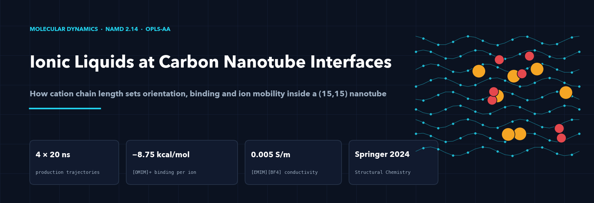
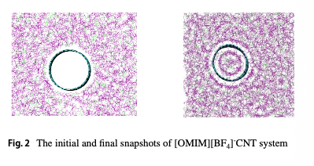
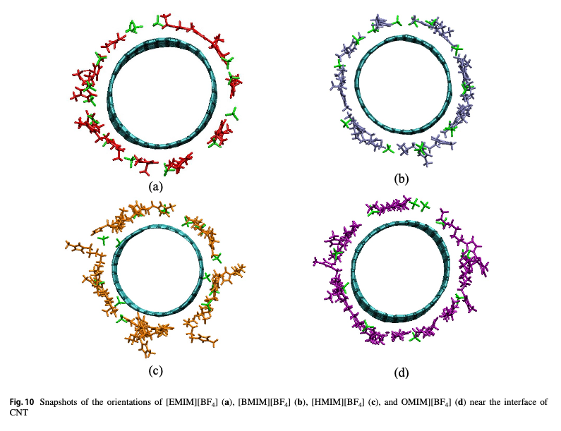
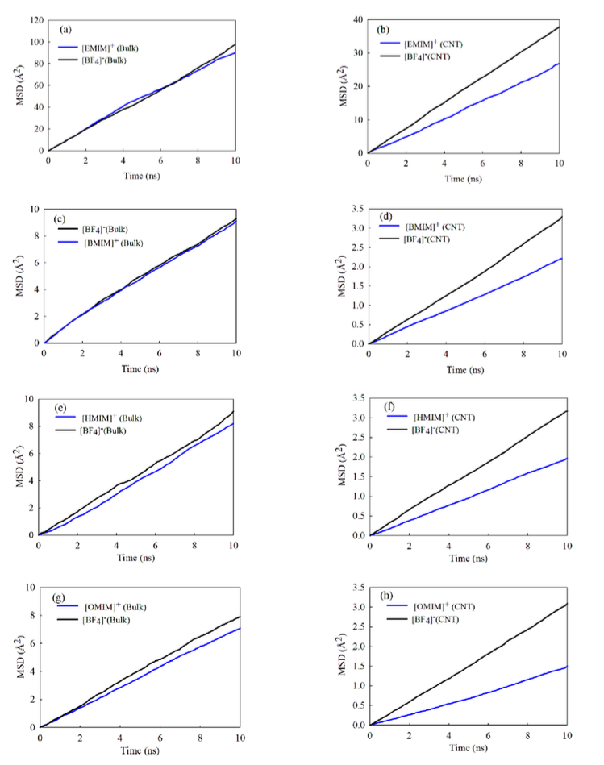
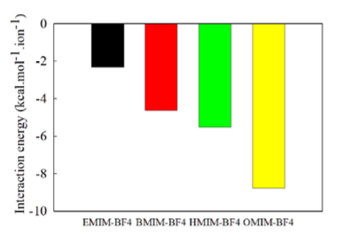

<p align="center"></p>

<div align="center">

[](https://doi.org/10.1007/s11224-024-02323-3)
[](https://doi.org/10.1007/s11224-024-02323-3)
[](https://www.ks.uiuc.edu/Research/namd/)
[](#simulation-protocol)

Rima Biswas · Prateek Banerjee · **Soham Sudesh Kavathekar**
Process Simulation Research Group, School of Chemical Engineering, Vellore Institute of Technology

</div>

---

## The one-sentence version

**All-atom molecular dynamics of four imidazolium ionic liquids confined in a (15,15) carbon nanotube shows that the cation's alkyl-chain length sets how the ions orient, how strongly they bind to the tube wall and how fast they move: longer chains bind harder (−8.75 kcal mol⁻¹ per ion for [OMIM]⁺) while the shortest chain, [EMIM]⁺, conducts best (0.005 S m⁻¹).**

Carbon nanotubes bundle in most solvents through van der Waals attraction. Ionic liquids disperse them without chemical modification, but the interfacial mechanism was not resolved at the molecular level. This study resolves it for the [BF₄]⁻ series and connects it to the properties that matter for CNT-based electrolytes and supercapacitors: interfacial binding, ion mobility and hydrogen bonding.

<p align="center"></p>

---

## Systems

Four ionic liquids sharing the [BF₄]⁻ anion, differing only in cation alkyl-chain length, each with a (15,15) armchair single-walled CNT (50 Å long, 20.5 Å diameter, 1,260 carbon atoms) in a 65 × 65 × 65 ų box of 600 ion pairs.

| Ionic liquid | Cation | Chain |
|---|---|---|
| [EMIM][BF₄] | 1-ethyl-3-methylimidazolium | C2 |
| [BMIM][BF₄] | 1-butyl-3-methylimidazolium | C4 |
| [HMIM][BF₄] | 1-hexyl-3-methylimidazolium | C6 |
| [OMIM][BF₄] | 1-octyl-3-methylimidazolium | C8 |

## Simulation protocol

NAMD 2.14, OPLS-AA force field with CL&P parameters for the ions, CHELPG partial charges, particle-mesh Ewald electrostatics, 1 fs time step, frames every 1 ps.

| Stage | Ensemble | Length | Purpose |
|---|---|---|---|
| Minimisation | | | relax the packed configuration |
| Heating | NVT | 100 ps, five annealing cycles 300 to 650 K | equilibrate the ion distribution |
| Equilibration | NPT, 300 K, 1 atm | 5 ns + 5 ns | confirm nanotube filling |
| Production | NPT, 300 K, 1 atm | 20 ns per system | trajectory analysis |

Tools: [NAMD](https://www.ks.uiuc.edu/Research/namd/) for dynamics, [VMD](https://www.ks.uiuc.edu/Research/vmd/) for analysis, visualisation and CNT coordinates, [Packmol](http://leandro.iqm.unicamp.br/m3g/packmol/home.shtml) for initial packing.

---

## Results

### Orientation at the wall

Cations adopt two orientations, parallel and perpendicular to the tube surface. Short-chain cations ([EMIM]⁺, [BMIM]⁺) park their imidazolium ring against the sidewall; long-chain cations ([HMIM]⁺, [OMIM]⁺) lay the alkyl tail along the wall and push the ring toward the tube axis.

<p align="center"></p>

### Confinement slows the ions three- to four-fold

| System | D<sub>cation</sub>, bulk | D<sub>cation</sub>, in CNT | Reduction |
|---|---|---|---|
| [EMIM][BF₄] | 1.50 × 10⁻¹⁰ m² s⁻¹ | 0.44 × 10⁻¹⁰ m² s⁻¹ | ~3× |
| [BMIM][BF₄] | 1.47 × 10⁻¹² m² s⁻¹ | 0.36 × 10⁻¹² m² s⁻¹ | ~4× |
| [HMIM][BF₄] | 1.41 × 10⁻¹² m² s⁻¹ | 0.33 × 10⁻¹² m² s⁻¹ | ~4× |
| [OMIM][BF₄] | 1.20 × 10⁻¹² m² s⁻¹ | 0.28 × 10⁻¹² m² s⁻¹ | ~4× |

<p align="center"></p>

### Hydrogen bonding and interfacial binding both grow with chain length

| System | H-bonds per cation in CNT | Interaction energy with CNT (kcal mol⁻¹ ion⁻¹) |
|---|---|---|
| [EMIM][BF₄] | 0.78 | ≈ −1.5 |
| [BMIM][BF₄] | 0.81 | ≈ −4.0 |
| [HMIM][BF₄] | 0.89 | ≈ −6.5 |
| [OMIM][BF₄] | 1.01 | −8.75 |

Longer chains stack their tails parallel to the graphene-like wall, strengthening dispersion binding, and crowd the rings toward the axis where anion contact, and therefore hydrogen bonding, is more likely.

<p align="center"></p>

### Conductivity

[EMIM][BF₄] gives the highest confined ionic conductivity, 0.005 S m⁻¹, from the combination of the fastest self-diffusion and the fewest hydrogen bonds. Binding strength and mobility pull in opposite directions along the series, which is the design trade-off for CNT–IL electrolytes.

---

## Reproduce

Structures for the CNT and the four ionic liquids and a complete NAMD input chain for one system are in this repository.

```bash
namd2 IL219-Mixed_min.namd > IL219-Mixed_min.log      # minimisation; heating, equilibration and production follow the same pattern
vmd CNT.pdb IL219-Mixed_min.dcd                        # inspect
```

## Citation

> Biswas, R., Banerjee, P. and Kavathekar, S. S. (2024). Molecular dynamics studies on interfacial interactions between imidazolium-based ionic liquids and carbon nanotubes. *Structural Chemistry*, 35, 1743–1753. https://doi.org/10.1007/s11224-024-02323-3

## Contact

Soham Kavathekar · MS Chemical & Biomolecular Engineering, University of Pennsylvania · [stg3719@seas.upenn.edu](mailto:stg3719@seas.upenn.edu) · [LinkedIn](https://www.linkedin.com/in/soham-kavathekar-cheme)
